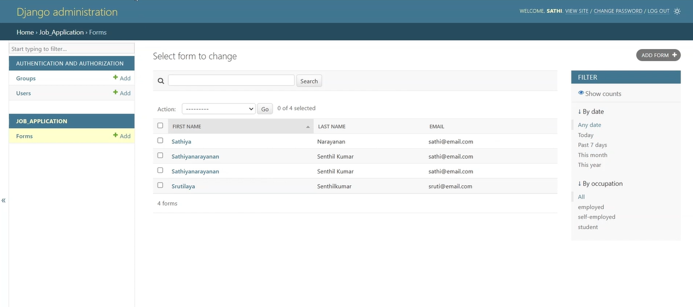
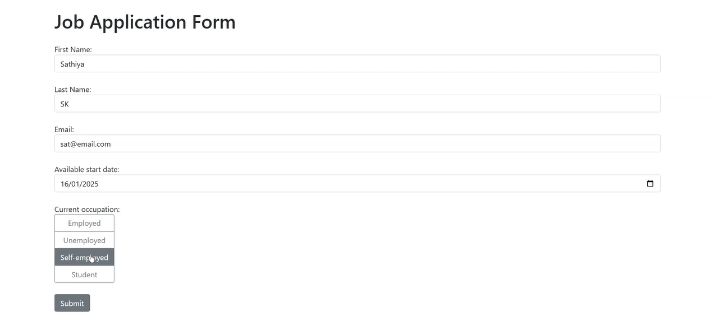

# 🌐 Web Application Form (Django Version)

A Django-based web application that allows users to submit a job application form. The application stores form data in a SQLite database and provides feedback to the user upon successful submission. This project uses **Django**, **Django ORM**, and **Bootstrap** for a seamless user experience.

---

## 🛠️ Features

- **Form Submission**: Collects user input for first name, last name, email, start date, and occupation.
- **Database Integration**: Stores form data in a SQLite database using Django's ORM.
- **User Feedback**: Displays success messages using Django's messaging framework.
- **Responsive Design**: Built with Bootstrap for a clean and responsive user interface.

---

## 🚦 How to Use

1. Install the required dependencies (`Django` and `Bootstrap`).
2. Run the Django development server using the provided script.
3. Access the web form via your browser, fill in the details, and submit the form.
4. View the submitted data in the SQLite database.

---

## 📸 Screenshots

---

## 🎥 Demo

---

## 📬 Contact

Feel free to explore the project and share your feedback. For any inquiries, suggestions, or contributions, reach out to me at **sathiyanarayanan.s1698@gmail.com**.
